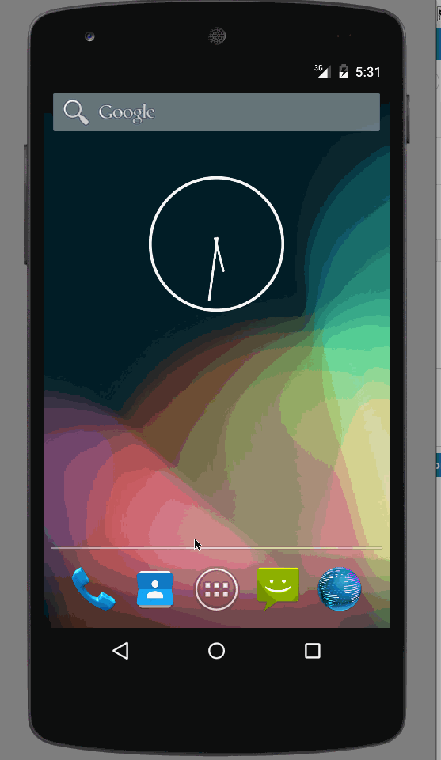

# CodePath App Submission

This is an Android application that supports the adding, removing, and editing of simple todo tasks from a todo list that is persisted to disk.
This is pre-work for the Codepath Android development class.

Completed user stories:

 * [x] Required: User can add an item to the todo list
 * [x] Required: User can delete an item from the todo list
 * [x] Required: User can edit an existing item from the todo list
 * [x] Required: When editing an item the edit field is in focus and the cursor is at the end of the text field.
 * [x] Required: Todo list items are persisted to disk and loaded when the app launches
 * [x] Optional: using SQLLite as data store
 * [x] Optional: using Itent Serializable interface to pass data between Activities i.e MainActivity vs EditItemActivity
 * [x] Optional: Empty items are not allowed to be aded to the todo list
 
Notes:

The user stories and fatures detailed in the [instructions](http://courses.codepath.com/snippets/intro_to_android/prework) have been implemented.
The required user stories are the ones detailed in the pre-work instructions. 
The optional user stories are the ones that were added for improvements.

Walkthrough of all user stories:

